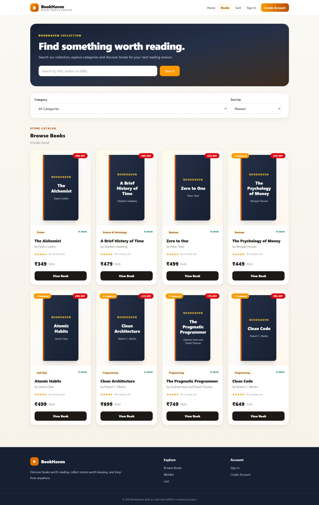
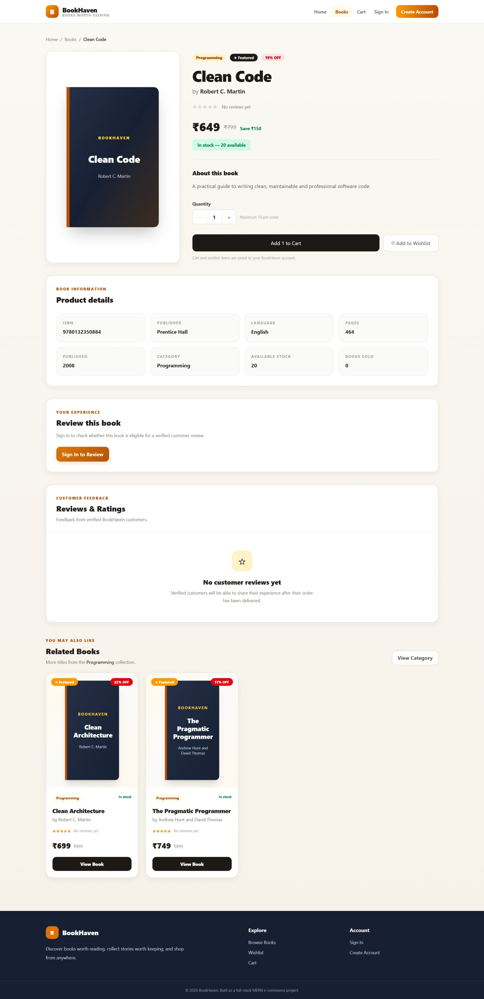
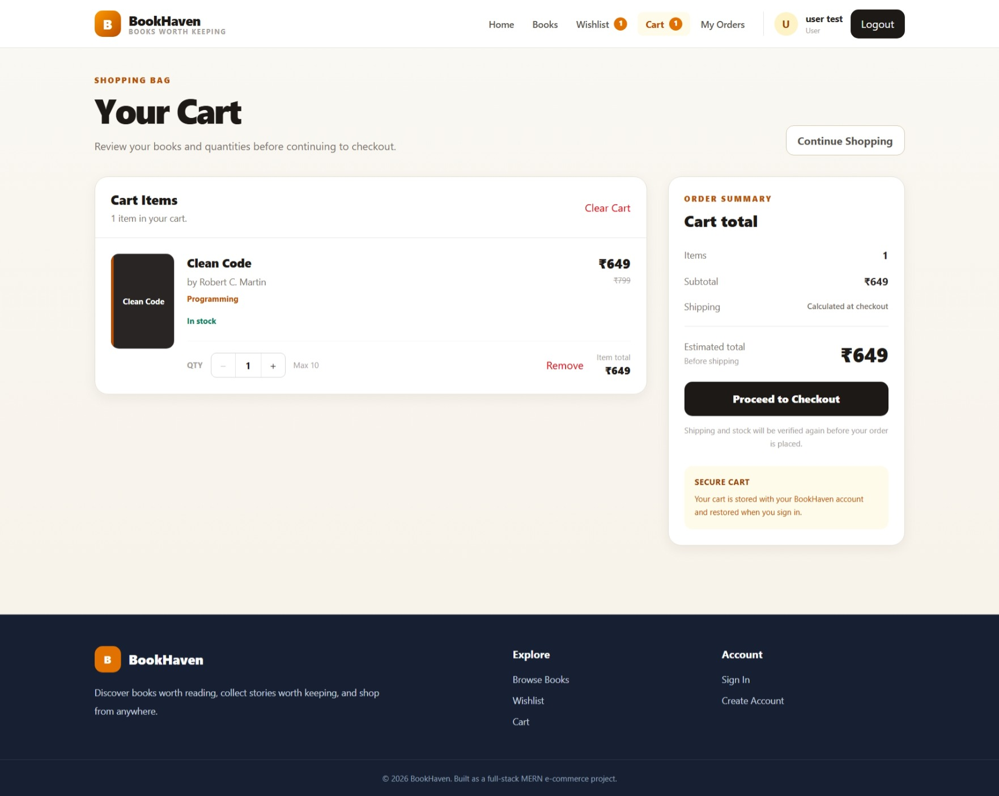
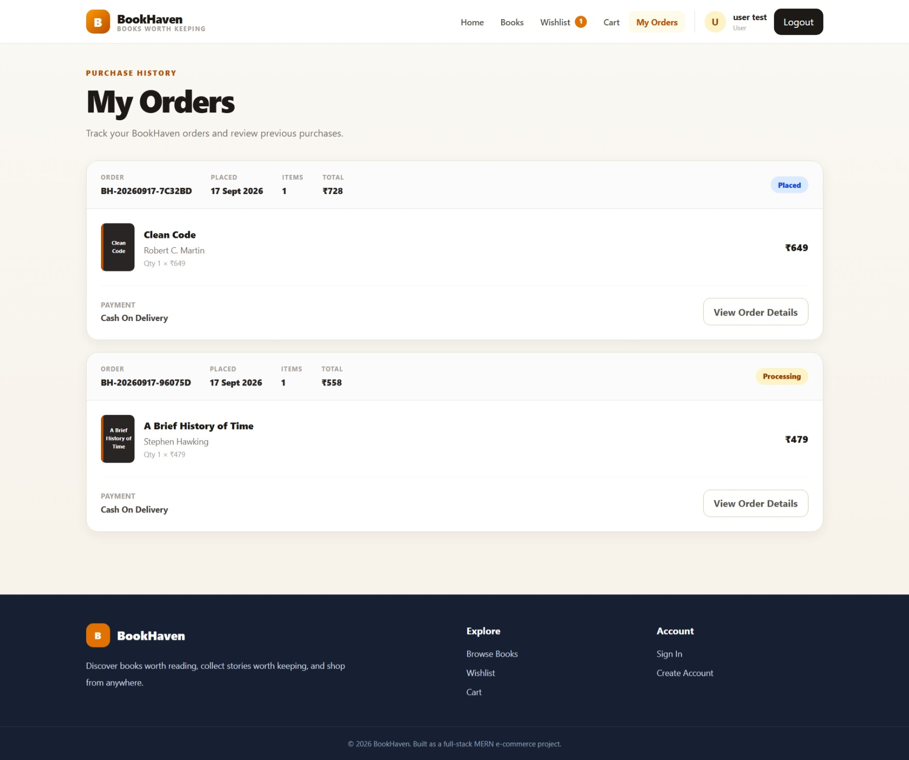
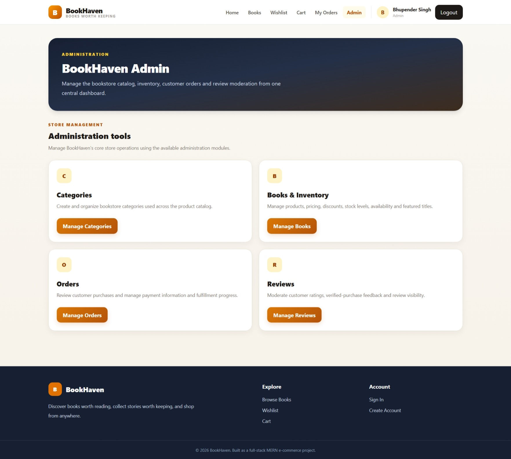
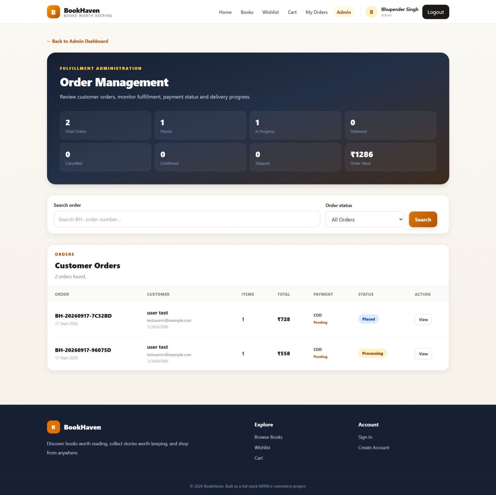

# BookHaven

BookHaven is a full-stack MERN e-commerce bookstore with authentication, role-based access control, persistent cart and wishlist, order management, verified-purchase reviews, and an Admin dashboard.

## Live Demo

- **Frontend:** https://bookhaven-eight.vercel.app/
- **Backend API:** https://bookhaven-api-ylz5.onrender.com/
- **Health Check:** https://bookhaven-api-ylz5.onrender.com/api/health

## Features

### Customer
- Register / Login with JWT authentication
- Browse, search, filter and sort books
- Book details with pricing, stock and related books
- Persistent cart and wishlist
- Cash on Delivery checkout
- Order history and order details
- Verified-purchase reviews
- Edit and delete own reviews

### Admin
- Manage categories
- Manage books and inventory
- Manage customer orders
- Update order status
- Moderate customer reviews
- Hide, restore or permanently delete reviews

## Order Flow

```text
Placed → Confirmed → Processing → Shipped → Delivered
```

## Reviews

Only customers with a delivered purchase can review a book.

Features include:

- 1–5 star ratings
- Verified Purchase badge
- Average rating calculation
- Rating distribution
- Review sorting and pagination
- Admin moderation

## Tech Stack

**Frontend**
- React
- Vite
- Redux Toolkit
- React Router
- Tailwind CSS
- Axios

**Backend**
- Node.js
- Express
- MongoDB
- Mongoose
- JWT
- bcryptjs
- Zod

**Deployment**
- Vercel
- Render
- MongoDB Atlas

## Architecture

```text
React / Vercel
      ↓
Node.js + Express / Render
      ↓
MongoDB Atlas
```

## Project Structure

```text
bookstore/
├── backend/
│   ├── controllers/
│   ├── models/
│   ├── routes/
│   ├── middleware/
│   ├── validators/
│   └── server.js
│
├── frontend/
│   ├── src/
│   │   ├── components/
│   │   ├── features/
│   │   ├── pages/
│   │   └── routes/
│   └── vercel.json
│
└── README.md
```

## Local Setup

Clone the repository:

```bash
git clone https://github.com/bhupender2412/bookhaven.git
cd bookhaven
```

### Backend

```bash
cd backend
npm install
npm run dev
```

Create `backend/.env`:

```env
PORT=5000
NODE_ENV=development
MONGO_URI=your_mongodb_connection_string
JWT_SECRET=your_jwt_secret
JWT_EXPIRES_IN=7d
CLIENT_URL=http://localhost:5173
```

### Frontend

```bash
cd frontend
npm install
npm run dev
```

Create `frontend/.env`:

```env
VITE_API_URL=http://localhost:5000/api
```

## Production

- Frontend deployed on Vercel
- Backend deployed on Render
- Database hosted on MongoDB Atlas

## Screenshots

### Home Page


### Book Catalog



### Book Details



### Shopping Cart



### My Orders



### Admin Dashboard



### Admin Order Management



## Author

**Bhupender Singh**

- GitHub: https://github.com/bhupender2412
- Portfolio: https://bhupender-portfolio-sage.vercel.app/